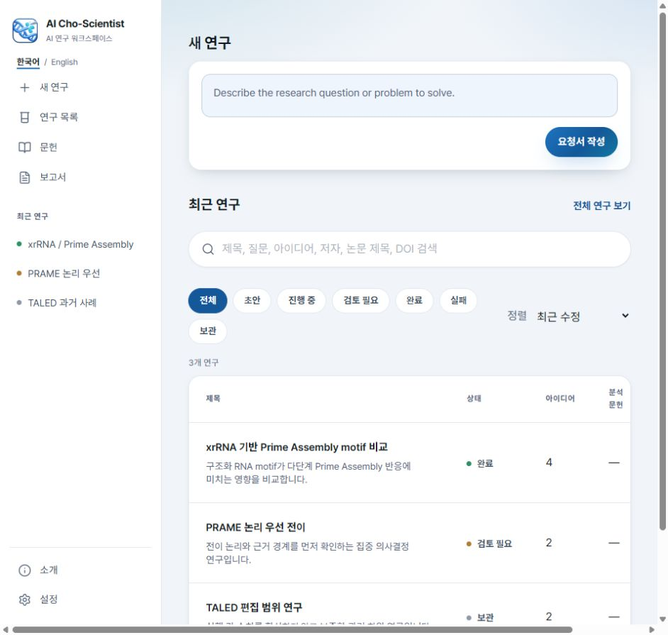

# AI Cho-Scientist Research Workspace

An operational, creator-scoped research workspace for AI Cho-Scientist. The homepage carries a private question from Standard or Breakthrough selection through zero-provider preflight, self-approval, execution, and artifact-first results.

[AI Cho-Scientist](https://app.aichoscientist.com/)

<p align="center">
  
</p>

## Current mode

Production publishes zero historical demonstration runs, artifacts, search records, or routes. Historical synthetic content is isolated under `tests/fixtures/` and can only be enabled by the explicit fixture-only test build.

Private run requests and results remain in the run-control API. No private scientific report, raw provider output, prompt, registry, request body, or laboratory data is serialized into the static deployment.

## Local use

Prerequisites:

- Python 3.11 or newer;
- Node.js with `pnpm`;
- a browser for the static preview and end-to-end tests.

```bash
pnpm install --frozen-lockfile
python -m pip install -e .
python -m coscientist.site validate-content --portal-root .
pnpm build
python -m coscientist.site preview-site --portal-root . --port 4173
```

Open `http://127.0.0.1:4173/runs/`.

## Verification

```bash
pnpm lint
pnpm typecheck
pnpm test
python tests/run_all.py
pnpm test:content
pnpm build
pnpm test:links
pnpm test:budget
pnpm test:zero-demos
pnpm test:e2e
```

## Publication

```bash
python -m coscientist.site publish-run \
  --run-root /path/to/sanitized-run-bundle \
  --portal-root . \
  --visibility PUBLIC_SANITIZED
```

Publication is allowlist-only, rejects unsafe paths and secret patterns, generates receipts and content hashes, and verifies that the source run tree is unchanged. See [CONTENT_PUBLICATION_GUIDE.md](CONTENT_PUBLICATION_GUIDE.md).

## Architecture

- Next.js App Router + TypeScript
- static export shell with trailing-slash routes and a private run-control API
- client-side search, filters, preferences, and intake downloads
- run-mode-aware portfolio funnels, idea lifecycle filters, score vectors, and summary-only idea pages
- PDF.js browser renderer with native open/download fallback
- deterministic Python publication CLI
- production output audit requiring zero historical demo routes, records, and artifacts

The scientific runtime is outside this repository and remains unchanged. Source-run locations are supplied to the publication CLI at execution time and are never serialized into published content.

The current deployment receipt is recorded in [`DEPLOYMENT_RECEIPT.json`](DEPLOYMENT_RECEIPT.json).

## License

- Source code is released under the [MIT License](LICENSE).
- Original synthetic demonstrations, project-created reports, interface copy, and project-created figures are released under [CC BY 4.0](LICENSE-CONTENT.md).
- Third-party material retains its original license; see [`THIRD_PARTY_NOTICES.md`](THIRD_PARTY_NOTICES.md).

## Feedback and contact

Questions, corrections, and feature requests are welcome through [GitHub Issues](https://github.com/Park-Junjae/scientific-core-research-portal/issues) or at [best916116@gmail.com](mailto:best916116@gmail.com).
